# SINFOR
## Sistema de Vacinação - COVID-19

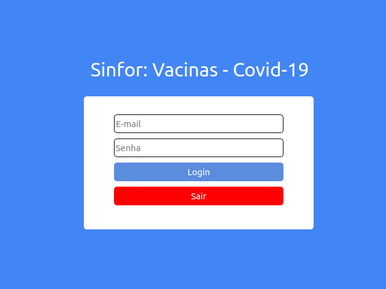

 Tela de Login 

O SINFOR é um sistema, não oficial, que tem como finalidade servir de ajuda aos servidores de saúde para auxiliar na vacinação contra o Covid-19.
O SINFOR foi criado em python3.9 e sua interface feita com a biblioteca pyQt5. O sistema pode ser usado em Windows, ou superiores, como Linux e Mac.

Colaboradores:  
1. [Vitor Santos](https://github.com/viktorsht)  
2. [Wendel Nunes](https://github.com/WendelSantosNunes)  
3. [Humberto Júnior](https://github.com/1bertojunior)  
4. [Eva Luana](https://github.com/evalasilva)  

### Observações:
>O sofware foi criado durante a disciplina de Engenharia de Sofware, ministrada no curso de Sistema de Informação na Universidade Federal do Piauí.
>Não há intuito comercial, ou governamental. 
>O projeto SINFOR é proprio e serve apenas para fins de aprendizado e experiencia de desenvolvimento em grupo. O projeto não possui nenhuma licensa.

## Requisitos:

1. [python3](https://www.python.org/downloads/)
2. [pyQt5](https://pypi.org/project/PyQt5/)

### Observação: 
> Será necessário a instalação do [pip](https://pip.pypa.io/en/stable/installation/) para a instalação do [pyQt5](https://pypi.org/project/PyQt5/).

## Instalação:

### Instalação Python3 
1. Windows: [Download](https://www.python.org/downloads/)
2.Linux Debian e derivados.

	~~~ Bash
		$ sudo apt-get install python3
	~~~

### Instalação pyQt5 
1. [pyQt5](https://pypi.org/project/PyQt5/)
 > Para realizar a instalação o [pyQt5](https://pypi.org/project/PyQt5/) é necessário a instalação do [pip](https://pypi.org/project/pip/)
 1. Instalação do PIP - LINUX
 
 	~~~ Debian
		$ sudo  apt-get install python-pip
	~~~
	~~~ Red Hat/ OpenSUSe
		$ sudo  yum install python-pip
	~~~

## Executar o programa:

1. Clone o repositório em sua máquina utilizando o comando git clone e logo após, execute o arquivo main.py.

	~~~ Git
		$ git clone https://github.com/viktorsht/SINFOR.git
 	~~~
	
	~~~ Bash/Prompt
		$ python3 main.py
 	~~~
2. Executável Windows: Para não ter que fazer a instalação, disponibilizamos um executável .exe. Saiba como encontrá-lo abaixo: abaixo:

> Encontre o arquivo main.exe e dê dois cliques.
 
~~~executável
	C:\SINFOR\Build\exe.win-amd64-3.9\main.exe
~~~

## Interfaces: 

> As telas de interface foram feitas em pyQT5.
### Tela Princial.

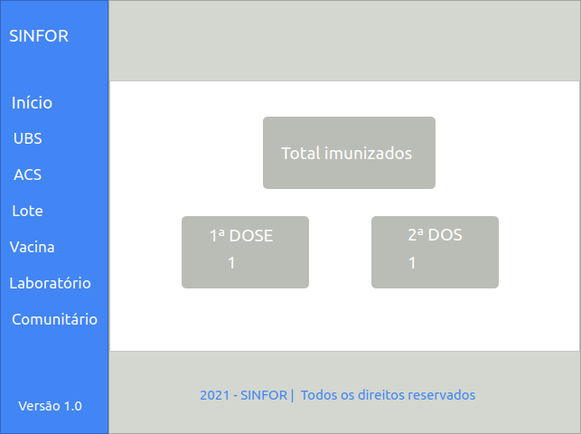

 Tela principal 

### O programa apresenta as seguintes telas de cadastro.

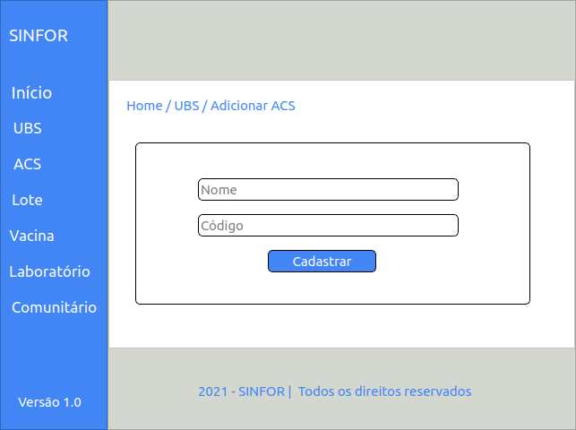

 Cadastro do Acs 

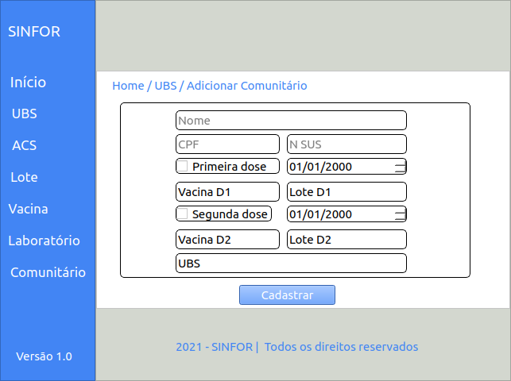

 Cadastro do Comunitátio 

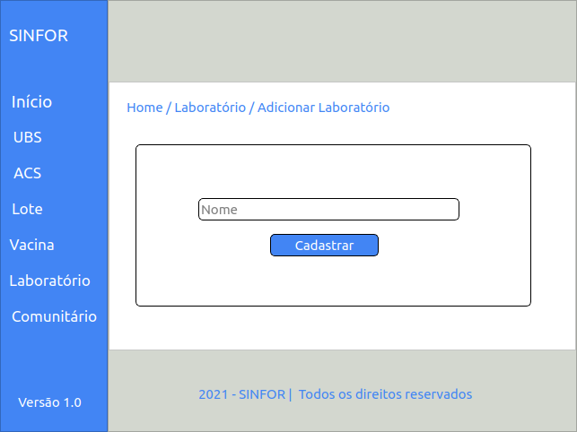

 Cadastro do Laboratório 

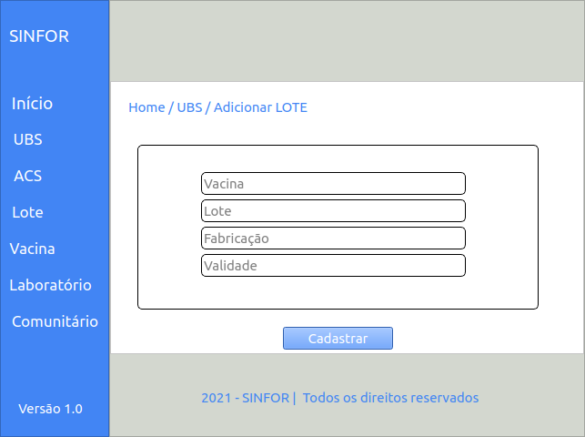

 Cadastro do Lote

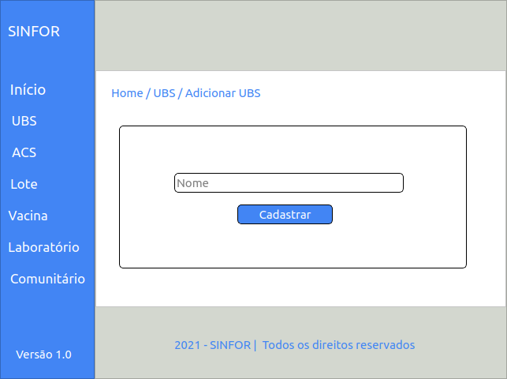

 Cadastro do UBS 

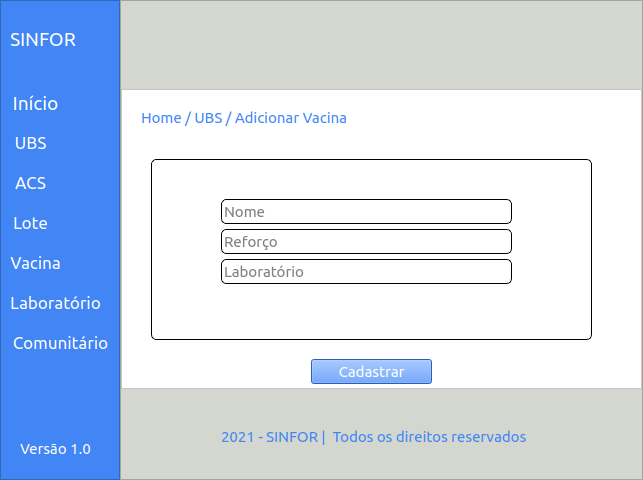

 Cadastro da Vacina 

### Telas de cada setor

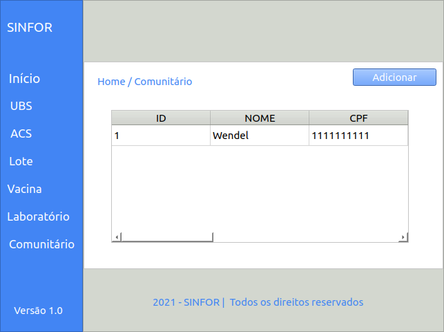

 Tela dos Comunitátios 

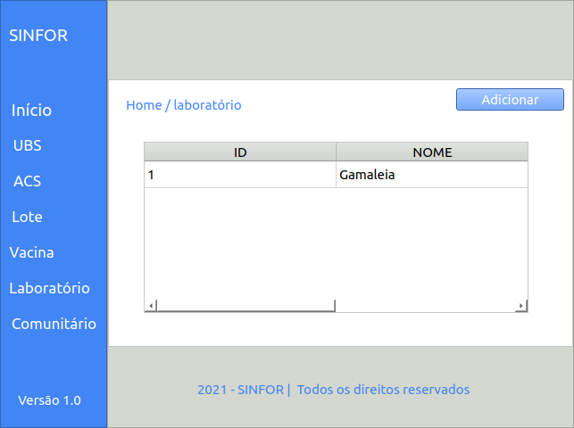

 Tela dos Laboratórios 

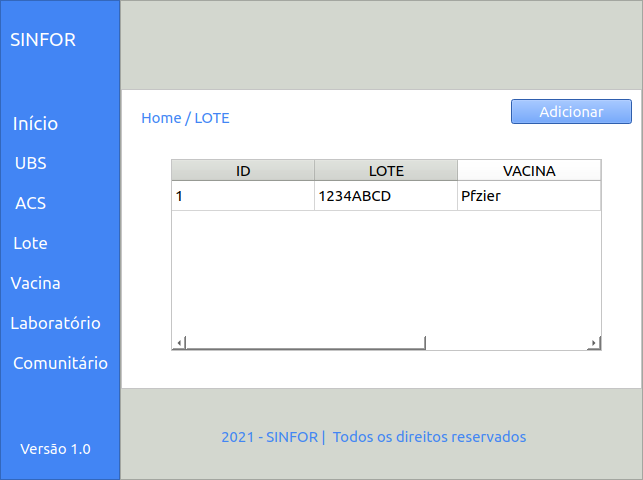

 Tela dos Lotes

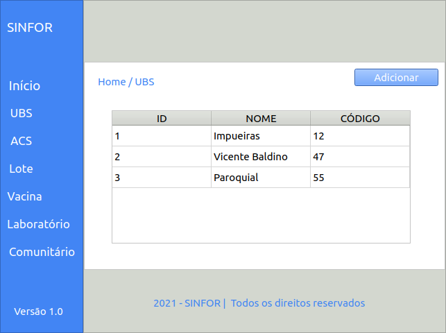

 Cadastro das UBS 

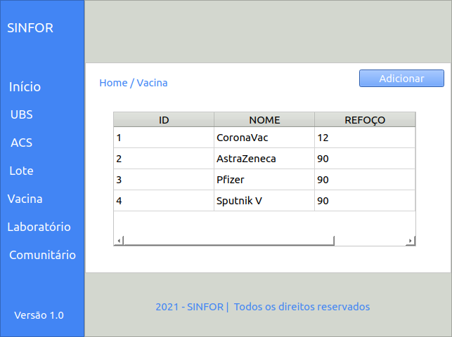

 Tela das Vacinas 

